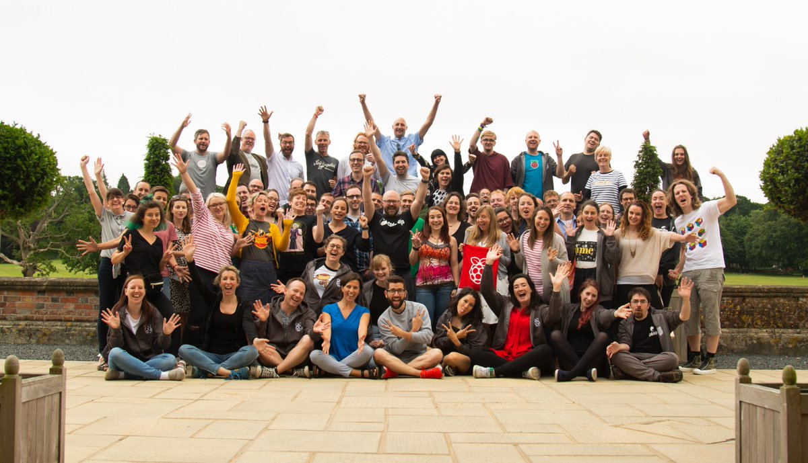

## Welcome to #RPiTranslate!

Thanks for your interest in joining our translation community. With your help, we will be able to reach more children and young people around the world and give them the opportunity to learn coding and digital making. 

This short guide will help you understand what we do and how. Please read it carefully so you know what’s involved and what you can expect. If you have any questions while reading the guide, feel free to [send us an email](mailto:translation@raspberrypi.org). 

