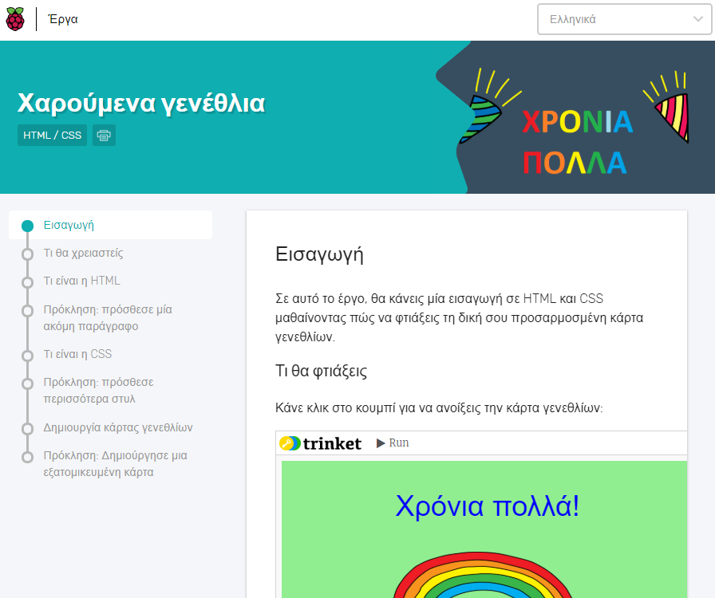

## What we translate

Most of the time, we translate the learning resources available on the [Raspberry Pi projects website](https://projects.raspberrypi.org). These resources are often used in [Code Clubs](https://projects.raspberrypi.org/en/codeclub) and [CoderDojos](https://projects.raspberrypi.org/en/coderdojo), but also by individual learners online. They are key to our informal learning programmes.

We recommend that you familiarise yourself with the format of the online learning resources as it will give you the necessary context for translating them. 

We will occasionally have other translation tasks, such as translation of subtitles for our teacher training videos or certificates, handbooks, and so on.  
