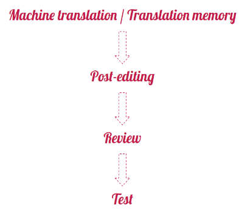

## Workflow

We want our learning resources to be translated to the best quality possible. That’s why we take each resource through four stages.

### Step 1: Machine translation / Translation memory

Each task is pre-translated using a machine translation engine such as Google Translate, and we also use our previous translations to fill in any repetitive text (this is called Translation memory). This is done to speed up the translation process and leave you with less work.

### Step 2: Post-editing

This is when a volunteer corrects a text that was pre-translated using machine translation software. Occasionally, machine translation is not available so the volunteer translator has to translate the task from scratch.

### Step 3: Review (also called proofreading)

This is when a volunteer reviewer compares the translation to its English original to make sure that nothing has been mistranslated, omitted, or added. 

### Step 4: Testing

After a reviewed translation is published, a volunteer tester goes through it to try it out and ensure that everything is understandable and the project can be completed.

The same person cannot do more than one of these stages for a given task. You can, however, do a translation for one task and a review for another task. 
