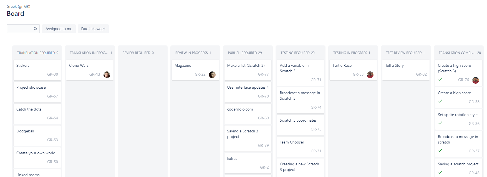
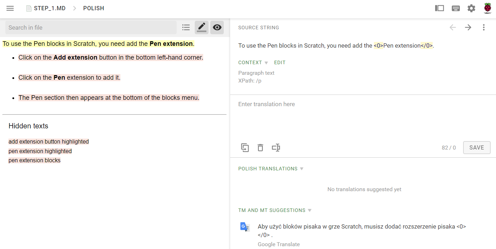
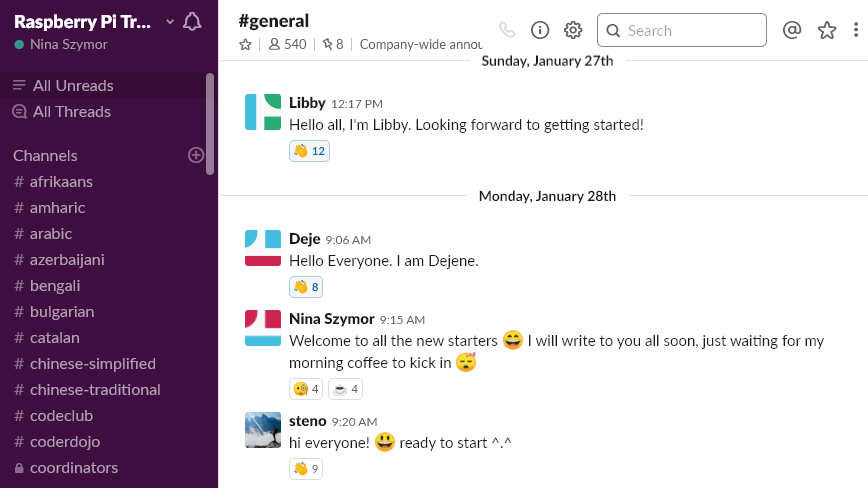

## Tools

As a volunteer, you will be using three tools:

### Jira

This is the main space where you will choose the tasks you want to work on and where you’ll keep everyone updated on your progress. You will also be able to access various support materials and resources there. When you log in to Jira, you will be taken through a tutorial which will explain how to use it.

### Crowdin

This is an online translation platform that we use for translating and reviewing tasks. You will learn how to use Crowdin once you log in to our Jira community space.

### Slack

Slack is used for communicating with other volunteers and the Raspberry Pi translation team; it allows you to get to know others and to easily keep in touch. It’s also a good way to create new contacts and get advice – many members of the Raspberry Pi Foundation, Code Club and CoderDojo are there.

