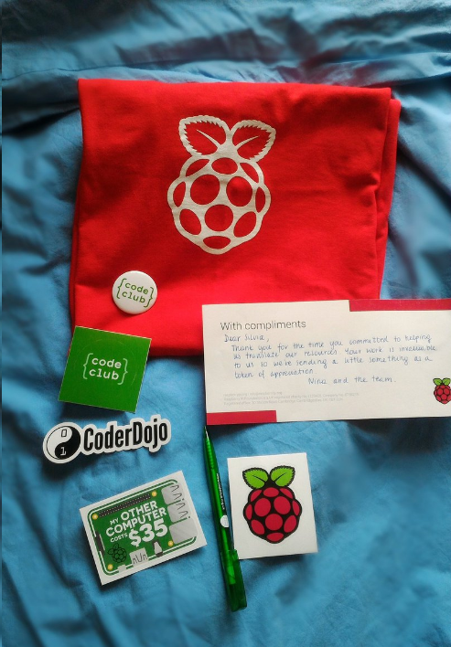

## Recognition scheme

We do our best to recognise the hard work of our amazing volunteers. That’s why we have introduced a recognition scheme that helps us ensure everyone gets the credit they deserve.

If you complete at least 10 tasks, you will receive a letter from us with stickers, a pen and a pin badge. The more tasks you complete, the better the rewards – you can get a t-shirt, a magazine subscription or even a Raspberry Pi if you are exceptionally committed to our efforts. 

The recognition scheme changes with time because we continually improve it. If you'd like to know more, feel free to [email us](mailto:translation@raspberrypi.org).
